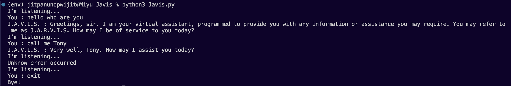

# J.A.R.V.I.S: The Iron Man's Assistant using Python & ChatGPT

### Overview
J.A.R.V.I.S (Just A Rather Very Intelligent System) is Tony Stark's trusty AI assistant in the Iron Man series. In this project, we aim to recreate a simplified version of J.A.R.V.I.S using Python and leverage the power of OpenAI's ChatGPT for conversational capabilities.

### Features
Voice recognition to take commands.
Text-to-speech functionality for responses.
Conversational capabilities powered by ChatGPT.
Extensible architecture to add more functionalities.



### Requirements
- Python 3.x
- ALl library in `requiment.txt`
- OpenAI API key from https://platform.openai.com/api-keys

## Installation
1. Clone the repository:
    ```
    git clone https://github.com/teenteennnii/javis.git
    ```
2. Create a Virtual Environment:
    ```
    python3 -m venv venv
    ```
3. Activate the Virtual Environment:
    - On macOS and Linux:
        ```
        source venv/bin/activate
        ```
    - On Windows:
        ```
        .\venv\Scripts\activate
        ```
4. Install the required packages:
    ```
    pip install -r requirements.txt
    ```
5. Run the program:
    ```
    python3 Javis.py
    ```
6. Deactivating the Virtual Environment:
    ```
    deactivate
    ```